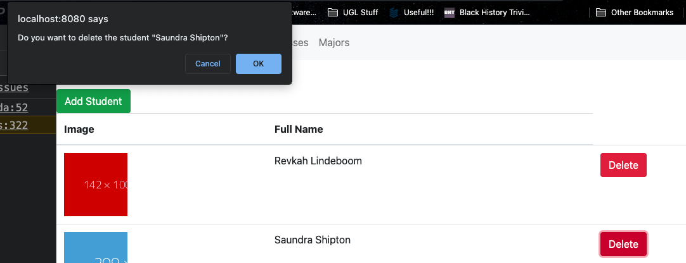
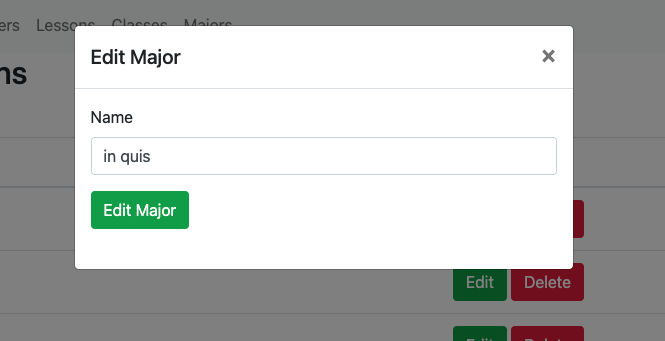
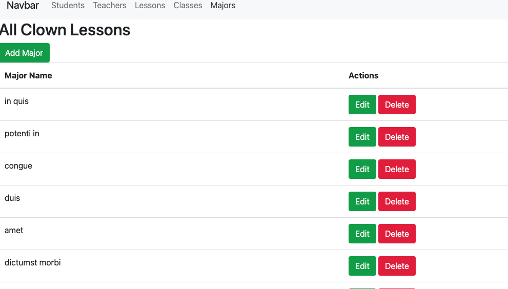
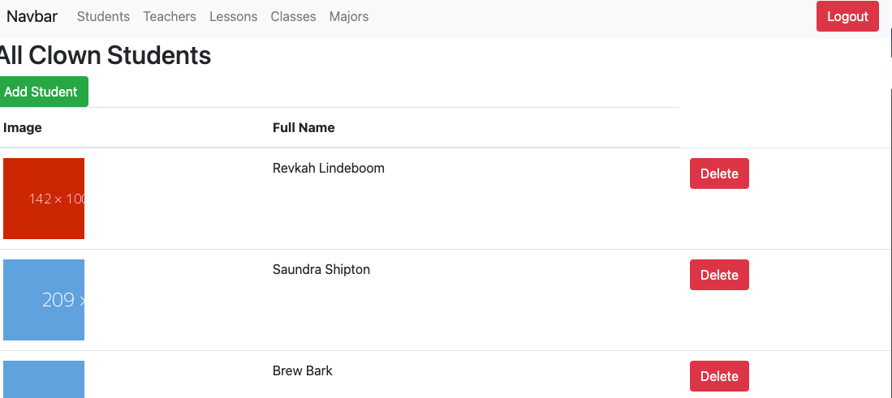

# Clown College 

The art of comedy is not lost, especially not here at <funny name>. Due to declining enrollment numbers, the Dean wants an admin dashboard to keep track of the students, the teachers, the classes, and the lessons.

[View App](https://e14-clown-college.netlify.app/)

## Features

- Google Authentication
  - If unauthenticated the application is Read Only
  - If authenticated the application, the user can do full CRUD

#### Students

- View all Students
- Add a Student
- Edit a Student
- Remove a Student

#### Teachers

- View all active Teachers
- Create a Teacher
- Edit a Teacher
- Delete a Teacher

#### Lessons

- View all the Lessons
- Add a Lesson
- Edit a Lesson
- Delete a Lesson

#### Classes

- View all the Classes
- Add a Class
- Edit a Class
- Delete a Class

#### Majors

- View all the Majors
- Add a Major
- Edit a Major
- Delete a Major

#### Assign to Classes

- assign a Teacher to a Class
- assign a Student to a Class
- assign a Lesson to a Class
- view a single class and all the things

#### Assign to Majors
- create Majors by adding classes to them
- view the Major and all the Classes and Lessons for each class

#### Stretch Goal: Grade Tracking
- track the grades of each student
- assign a grade to a student when viewing the class
- view the grades of the students when viewing the Class
## Relevant Links

- [Check out the deployed site] (https://e14-clown-college.netlify.app/)

LOOM VIDEO:

ERD:

LUCIDCHART:
https://lucid.app/lucidchart/66395ef9-9b5c-4b36-9bc7-bf094a80db06/edit?page=0_0#

FIGMA:
https://www.figma.com/file/MJSR9cLCT8XTJ2wioCJ54M/Clown-College-Group-Project?node-id=124%3A1

- [Project Board](https://github.com/nss-evening-cohort-14/clown-college-dashboard-clown-college-dashboard/projects/1)

<iframe width="560" height="315" src='https://dbdiagram.io/embed/605a8522ecb54e10c33cef28'> </iframe>

## Project Screenshots

## Contributors
Ben Jarrett : https://github.com/BenJarrett
Sara Schoonover : https://github.com/SaraSchoonover
Nathan Keith : https://github.com/nashvegasnate
Dani Crosby : https://github.com/danicrosby

- [Trinity Christiana](https://github.com/TrinityChristiana)
